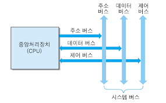

## 컴퓨터의 구성

### 하드웨어 (Hardware)
> 컴퓨터를 구성하는 기계적 장치로, CPU, 입출력장치, 기억장치 등이 하드웨어에 속함. 

### 소프트웨어 (Software)
> 소프트웨어는 하드웨어의 동작을 지시하고 제어하는 **명령어 집합**으로, OS나 Compiler와 같은 시스템 SW와 워드나 엑셀과 같은 응용 SW로 구분됨.

### 기억장치
> 기억장치란 하드웨어의 일부로 프로그램, 데이터, 연산의 중간 결과를 저장하는 장치임.
- 주기억장치
    - RAM(휘발성), ROM(비휘발성)등이 여기에 속함.
    - 비교적으로 용량이 크고 처리 속도도 빠름.
    - CPU 명령에 의해 기억된 장소에 직접 접근하여 읽고 쓰는 작업이 가능함.

- 보조기억장치
    - 주기억장치에 비해 속도는 느리지만 비교적 많은 데이터를 저장할 수 있다는 장점이 존재함.
    - HDD
        - 물리적인 디스크를 고속으로 회전시켜 데이터를 저장하는 장치
        - 소음이 심하고 외부 충격에 약함
    - SSD
        - 반도체를 기반으로 하는 정보 저장 기억장치로, 전기적 신호를 통해 데이터를 저장함.
        - HDD보다 비싸지만 속도가 빠름

### 시스템버스
> 하드웨어 구성요소를 물리적으로 연결하는 선으로, 각 구성요소가 다른 구성요소로 데이터를 보낼 수 있도록 통로가 되어줌.

  

- 데이터버스
    - CPU와 기타 장치 사이에서 데이터를 전달하는 통로이며, **양방향버스**임.
    
- 주소버스
    - 메모리의 주소나 I/O의 포트번호를 전달하는 통로임.
    - CPU에서 저장/입출력 장치로 기억장치 주소를 보내는 역할을 하기 때문에 **단방향버스**임

- 제어버스
    - 데이터/주소버스를 제어하기 위해 제어 신호를 전달하는 통로임.
    - 제어버스는 읽기/쓰기 동작을 모두 수행하기 때문에 **양방향버스**임

