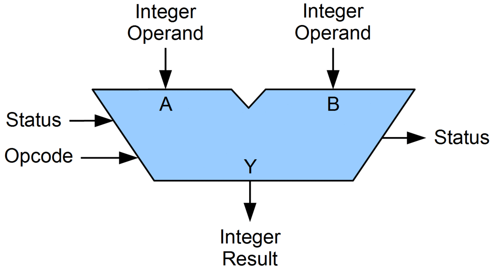

## 중앙처리장치 (CPU)

### 정의
> 주기억장치에서 프로그램 명령어와 데이터를 읽어와 처리하고 작업을 수행하는 하드웨어

### 3가지 구성요소
- ALU (산술논리연산장치)
    - 명령 제어장치로부터 명령을 받아 CPU로 들어온 모든 데이터들을 산술/논리 연산하는 장치
    - 가산기, 보수기와 같은 요소가 포함되어 있음.

    

- 제어장치
    - 명령어의 **해석**(Fetch)과 **실행**(Execute)을 담당하는 제어장치.
    - 수행 중인 명령을 저장하는 **명령 레지스터**와 명령어를 해독하여 제어신호에 보대는 **명령 해독기** 등으로 구성됨.

- 레지스터
    - CPU 내부에 있는 저장장치로 주기억장치인 RAM보다 빠른 속도로 CPU에 정보를 제공하는 역할을 함.
    - 빠르다는 장점을 가지고 있지만, 비쌈.
    - 종류
        - PC (Program Counter): 메모리에서 인출될 명령어의 주소를 가지고 있는 레지스터.
        - AC (Accumulator): ALU에서 연산된 결과를 임시저장하는 레지스터.
        - IR (Instruction Register): 명령어 레지스터로 현재 실행되고 있는 명령어를 기억하고 있음.
        - MAR (Memory Address Register): 메모리에서 읽거나 쓸 데이터의 주소를 저장하는 레지스터.
        - MBR (Memory Buffer Register): 메모리에서 읽거나 쓰는 데이터를 일시적으로 저장하는 레지스터.

### 명령어 사이클 동작 과정
<br>

- 인출: 메모리에 있는 프로그램 데이터를 CPU로 불러오는 작업.

- 해석: 명령 제어장치에서 불러온 명령어를 해석.
- 실행: 해석된 명령어를 ALU에서 연산 진행.
- 쓰기: 결과를 메모리에 보내어 기록.


### ADD 명령어 작동 예시
```
## Fetch 단계
MAR <- PC 
MBR <- MEMORY[MAR]
PC <- PC+1
IR <- MBR

## Execute 단계
MAR <- IR(addr)
MBR <- MEMORY[MAR]
AC <- MBR + AC
```