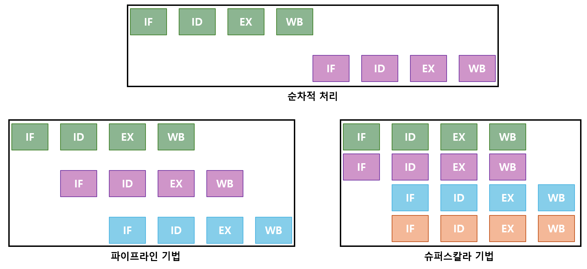

## 병렬처리

### 정의
> 병렬처리란 동시에 여러 개의 명령어를 처리하여 작업의 능률을 올리는 방식을 의미함.

### 특징
- 상호 의존성이 없어야 병렬처리가 가능함
- 각 단계의 처리 시간이 거의 일정해야 최적의 효과를 얻을 수 있음.
- 예를 들어, 입출력에서 오래 걸리는 task의 경우 입출력이 지연되는 만큼 병목현상이 일어남
- 많은 단계로 나누면 이론적으로 많은 작업을 함께 진행하여 효율이 좋아질 것 같지만 그렇지 못함.

### 병렬처리 과정

> 기본적으로 CPU에서는 아래와 같은 방식으로 명령어가 실행됨.
1. IF(instruction Fetch): 다음에 실행할 명령어를 명령어 레지스터에 저장하는 과정
2. ID(instruction Decode): 다음에 실행할 명령어를 해독하는 과정
3. EX(Execution): 해석한 결과로 실제 명령어를 실행하는 과정
4. WB(Write Back): 명령어 실행 결과를 메모리에 저장하는 과정

 

### 파이프라인 vs 슈퍼스칼라
- 병렬처리에는 크게 파이프라인 기법과 슈퍼스칼라 기법이 존재함.

- 파이프라인
    - 명령어를 겹쳐서 실행하는 방식으로 하나의 코어에 여러 쓰레드를 실행하는 멀티 쓰레드 기반의 방식임
    - N개로 분할된 Task의 각 단계가 종료될 때마다 새로운 Task가 들어오는 형식
    - K단계의 파이프라인 + N개의 명령어를 실행하는데 걸리는 시간은 **K + (N-1)** 임
- 슈퍼스칼라

    - 파이프라인이 처리할 수 있는 코어를 여러개 구성하여 복수 개의 명령어를 동시에 실행하는 방식임
    - 오늘날 CPU의 대부분이 슈퍼스칼라 기법을 사용함.
    - K단계의 파이프라인 + N개의 명령어 + M개의 파이프라인이 중첩되어 있을 때 걸리는 시간은 **K + (N - M)/M** 임
- 슈퍼파이프라인

    - 기존 파이프라인 기법에서 하나의 파이프라인을 여러 개로 쪼개서 성능을 향상하는 기술
    - 1 Clock당 수행 횟수가 1이었을 때, 이를 2, 3, ... 이렇게 늘려서 파이프라인을 쪼개는 것임
    - K단계의 파이프라인 + N개의 명령어 + 1 Clock당 실행횟수 P일때 실행 시간은 **K + 1/P(N - 1)** 임

- 슈퍼파이프라인 슈퍼스칼라
    - 슈퍼스칼라 + 슈퍼파이프라인
    - 각 파이프라인당 복수개의 명령어를 처리할 뿐만 아니라 Clock당 수행 횟수를 증가시킨 병렬 기법
    - 실행 시간은 **K + (N - M)/(PxM)*** 임

### 파이프라인 위험(Hazard)
> 파이프라인 위험은 파이프라인 기법을 사용하는데 있어서 발생할 수 있는 문제점들을 의미함

- 데이터 위험
    - 데이터 위험은 명령어 간 의존성으로 인해 아직 수행되지 않은 명령어의 결과값을 참조함으로써 발생하는 위험임
    - 1번째 명령어의 결과가 R1이라 할 때, 결과가 아직 나오지 않았는데 다음 명령어에서 R1의 주소를 Fetch해야하는 상황.
    - 이러한 경우는 **R1 결과가 나오기 전까지 다음 명령어를 지연시킨 후 정상적으로 Fetch 과정에 들어가게 됨.**

- 제어 위험
    - 제어 위험은 Jump, Interupt와 같은 분기 명령어에 의해 PC가 갑자기 변하게 됨으로써 발생하는 위함
    - 즉, 현재 파이프라인이 4단계로 구성되어있을 때, 1번째 명령어의 마지막 부분에서 분기를 진행할 경우 뒤에 실행 중인 2, 3, 4번째 명령어가 필요없어져 버릴 수도 있는 상황에 놓이게 됨.
    - 이러한 경우는 사전에 분기문을 예측하던가, 다양한 방식으로 해결이 가능함.

- 구조적 위험
    - 구조적 위험은 서로 다른 명령어가 같은 자원에 접근하는 경우를 의미
    - 명령어 1과 명령어 2가 동시에 동일한 자원에 Write하려고 접근할 때 **먼저 들어온 명령어부터 순차적으로 Write를 진행**함으로써 해당 자원을 사용할 수 있을 때까지 지연시킴