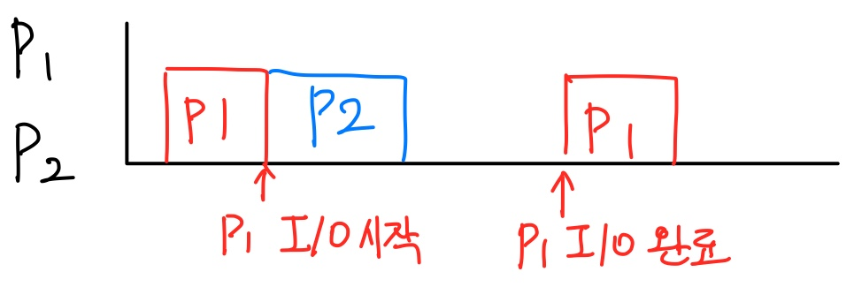
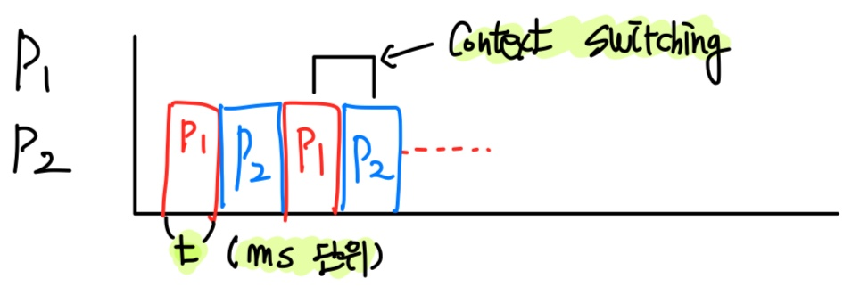
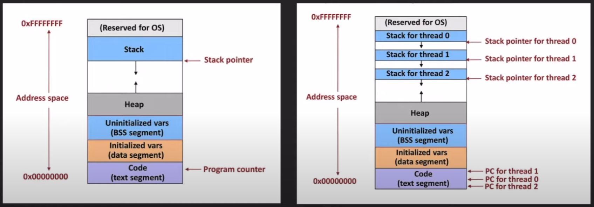
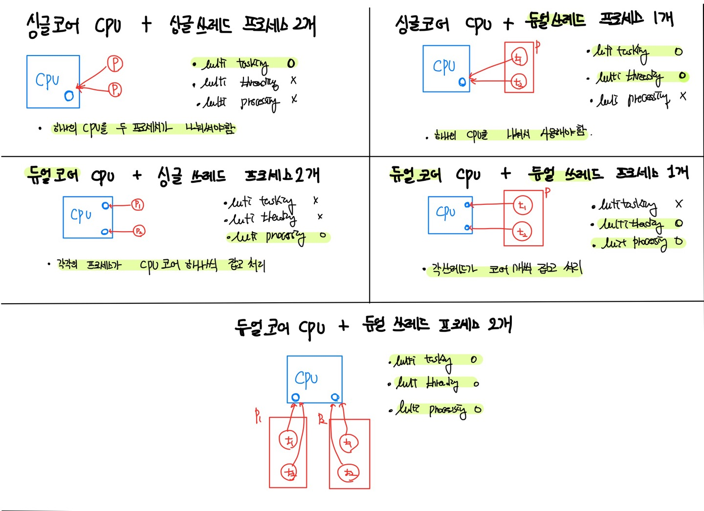

## 프로세스와 쓰레드

### 용어 정리
- 프로그램: 컴퓨터가 실행할 수 있는 명령어들의 집합
- 프로세스 컴퓨터에서 실행 중인 프로그램을 의미하며, 각각의 프로세스는 **독립된 메모리 공간**을 할당받음 (자원 공유가 안된다)
- CPU: 명령어를 실행하는 연산 장치
- 메인메모리: 프로세스가 CPU에서 실행되기 위해 대기하는 곳

### 단일 프로세스
- 한 번에 하나의 프로그램만 실행하는 경우
- 다른 프로그램을 실행하려면 현재 실행중인 프로그램을 종료해야 함
- CPU 사용률이 좋지 않음
- 예를 들어, CPU에서 P1을 실행시키다가 P1이 I/O작업에 들어가면 CPU는 놀고있음.
- 이를 해결하기 위해 멀티 프로그래밍이 나옴.

### 멀티 프로그래밍
 
- 하나의 프로그램이 I/O 작업에 들어갔을경우 CPU를 사용하지 못하는 단일 프로세스의 단점을 해결하고자 사용.
- 여러 프로그램을 메모리에 미리 올려두고 동시에 실행시키면 P1이 I/O작업 하는동안 P2, ... 작업이 실행될 수 있음.
- 이 또한 하나의 프로그램이 긴 CPU time을 가질 경우 다른 프로그램이 계속 대기하는 상태에 머무름.
- 이때 멀티 태스킹 개념이 나옴.

### 멀티 태스킹
 
- 프로세스가 한번 CPU를 사용할 때 아주 짧은 시간(quantum)만 CPU에서 실행되도록 하는 방식
- 프로세스의 응답 시간을 최소화시키는 것에 목적을 둠 (사용자가 보기에는 여러 프로그램이 동시에 프로그램이 실행되는 것처럼 보이게 함)
- 하나의 프로세스가 동시에 여러 작업을 수행하지는 못함
- 여러개의 프로세스를 사용하는 방법도 있지만, 프로세스간 **context switching**은 무거운 작업임
- 프로세스끼리 **데이터 공유가 까다로움** (작업 간 독립적이기 때문에)

### 쓰레드
 

- CPU에서 실행되는 단위이며, 하나의 프로세스는 한 개 이상의 쓰레드를 가질 수 있음.
- 동일한 프로세스 안의 쓰레드끼리는 **context switching이 가벼움**.
- **프로세스 안에 자원을 공유할 수 있음 (Heap 영역)**
- 프로세스 각각의 Stack영역과 Program Counter 영역은 공유하지 않음.

### 멀티 쓰레딩
- 하나의 프로세스가 동시에 여러 작업을 실행하는데 목적을 둠.
- 멀티 쓰레드의 경우 프로세스 내 자원을 공유할 수 있음.

### 멀티 프로세싱
- 두개 이상의 프로세서나 코어를 활용하는 시스템을 의미함

### 예제

