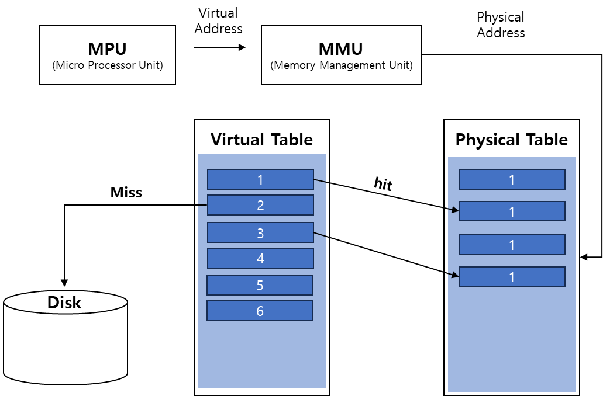
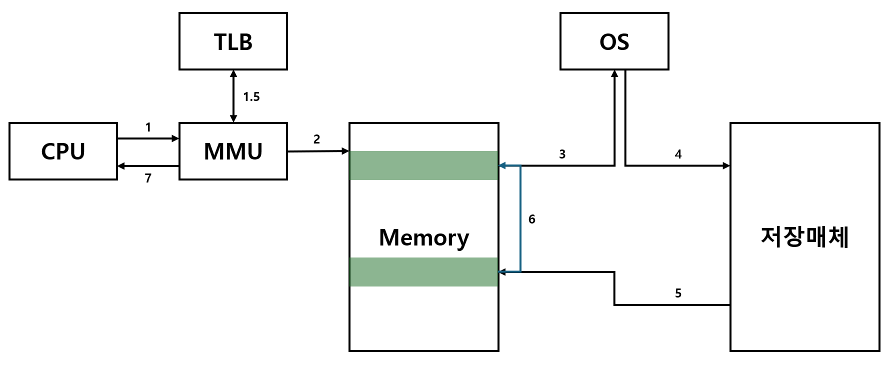

## 가상 메모리

### 배경
- 초창기 컴퓨터에서는 RAM 용량이 실행하고자 하는 프로그램보다 컸어야 했음 ⇒ 작으면 실행 불가능 => **오버레이 기법**이 나옴.
    - 오버레이 기법이란 커다란 프로그램을 N개의 작은 크기로 분할하여 필요없는 부분을 메모리에서 해제하고, 필요한 부분만 메모리에 올리는 방식으로 메모리 부족을 해결하고자 함.
    - 한정된 메모리 공간(RAM)내에서만 작동하기 때문에 근본적으로 메모리 부족 문제가 해결되지 않음.
- 그래서 가상 메모리가 출현하게 됨.
    - 실제 메모리보다 많아 보이게 하는 기술로, 어떤 프로세스가 실행될 때 메모리에 해당 프로세스 전체가 올라가지 않아도 실행이 가능하다는 점에 착안하여 고안되었음.
    - **실행에 필요한 부분은 메모리(RAM)에 올라가고, 나머지는 디스크(HDD)에 남게 됨.**
    - 디스크의 일부를 RAM과 공유함으로서 메모리 부족 문제를 해결가능하며, 이를 실행시키려면 **MMU**가 필요함.

### MMU (Memory Management Unit)
- 가상의 주소를 물리적 주소로 변환하고, 메모리를 보호하는 기능을 수행함.
- MMU를 사용하면 CPU가 각 메모리에 접근하기 전에 “**메모리 주소 번역 작업**”이 수행됨.

### 작동 원리

- 프로세서가 메모리로 가상 주소를 보냄.
- 가상 주소 테이블에서 물리적 주소 테이블로 매핑함.
- 매핑에 성공했을 때 해당 물리적 주소에 있는 데이터를 가져오고, 해당 Case를 **Hit**이라 함.
- 가상 주소 테이블 크기가 더 크기 때문에, 매핑되지 못하는 주소가 존재함 ⇒ 하드디스크로 이동 (**Miss**)

### Miss가 났을 때

- Miss가 난 부분을 디스크에서 찾아서 data를 물리적 주소 테이블에서 아무데나 저장함.
- 물리적 주소 테이블이 꽉찼을 경우 **LRU(Least Recently Used)에 따라 replacement 진행.**
- 교체되는 데이터를 하드디스크에 복사하고, 원래 자리에는 새 데이터를 덮어씌움.
- 가상 주소 테이블을 업데이트함.

### 페이징 시스템

- 메모리를 **크기가 동일한 page**로 가상 주소 공간과 이에 매핑되는 물리 주소 공간을 관리하는 것.
- 페이징과 반대되는 개념이 세그먼테이션(Segmentation) 임.
- 용어 정리
    - page (page frame) = 동일한 크기의 **block**.
    - paging table = 물리 메모리에 있는 page frame 번호와 해당 페이지의 첫 물리 주소를 매핑한 표.
    - **page fault** = 가상 주소를 물리 주소로 변환했는데, paging table에 없어 disk에 접근해야하는 경우 ( OS 직접 처리를 한다 ).

### TLB (Translation Lookaside Buffer)

- 가상 주소를 물리적 주소로 변환하는 속도를 높이기 위해 사용하는 캐시.
- 최근 일어난 가상 메모리와 물리 주소의 변환 테이블을 저장해둠.

### 실제 작동 방식

1. CPU가 MMU에게 Virtual address 전달.
2. MMU는 TBL(캐시)를 통해 Physical address로 변환.
3. page table에 접근하여 Physical address를 탐색, 있으면 CPU에 반환.
4. 없을 시 이러한 상황을 **page fault**라 하며, 이러한 상황은 OS가 처리를 진행함.
5. 저장 매체에서 필요한 data의 page block을 찾음.
6. 해당 page block을 메모리에 업로드 함.
7. page table을 업데이트 함
8. 다시 실행함 (이번엔 hit 결과를 얻게됨.)